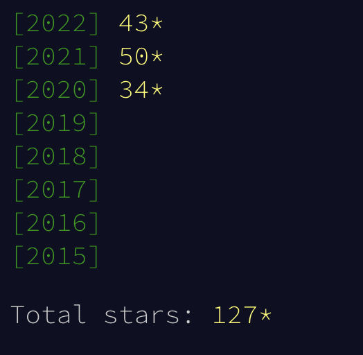

# advent-of-code


My solutions to the challanges of the [Advent of Code](https://adventofcode.com) 🎅🎄💻
- [2023](https://adventofcode.com/2023)
- [2022](https://adventofcode.com/2022)
- [2021](https://adventofcode.com/2021)
- [2020](https://adventofcode.com/2020)



## How to

### Install the project

#### Using Poetry
- `poetry install`

### Create a solution
Type `python scripts/create.py [year] [day]` to generate a new directory with a useful starter template.

Example: `python scripts/create.py 2021 10`

Params:
| name | type | mandatory | why? | 
|---|---|---|---|
| year | number | yes | It indicates the year |  
| day | number | yes | It indicates the day | 


### Run the solution(s)
Type `python scripts/run.py [year] [day] [--w]` to run one or multiple solutions.

Example: `python scripts/run.py 2021 15 --w`

Params:
| name | type | mandatory | default | why? | 
|---|---|---|---|---|
| year | number | no | ** | It indicates the year. If not provided, all the years will be considered |  
| day | number | no | ** | It indicates the day. If not provided, all the days will be considered| 
| --w | bool | no | False | When `True`, it will be executed in `watch` mode, and the solution(s) will run after each save | 

### Analyze your solution efficiency
Inside `utils/analysis` a `clock()` decorator is available to be applied to one or more of the solution's functions. The following optional parameters are accepted:

| name | type | mandatory | default | why? | 
|---|---|---|---|--|
| print_input | bool | False | False | When `True`, the input params are printed near the decorated function |  
| print_output | bool | False | False | When `False`, the output params are printed near the decorated function | 
  
Example:
```python
@clock(print_output=True)
def read_input():
    pass
```